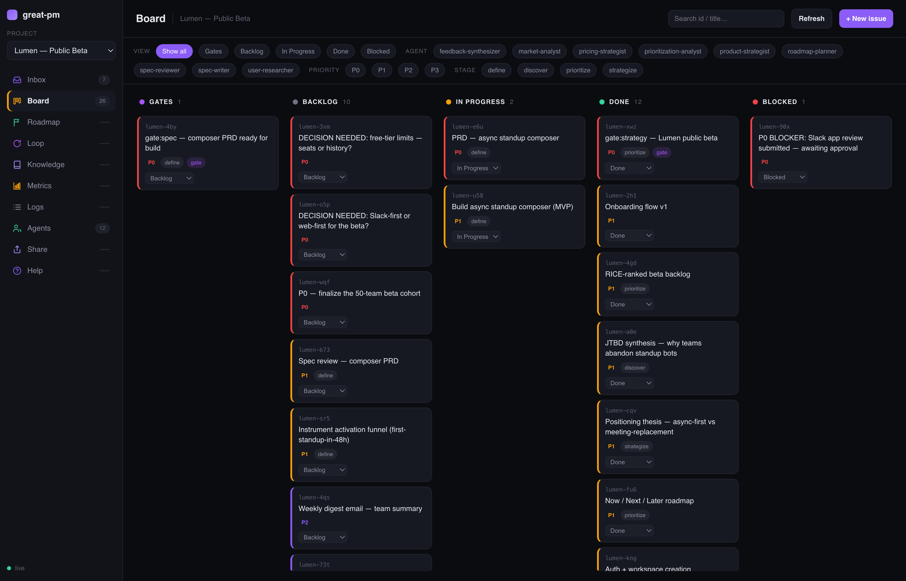
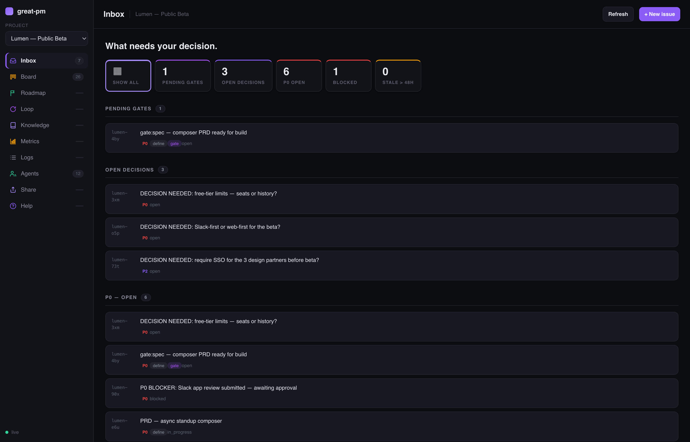
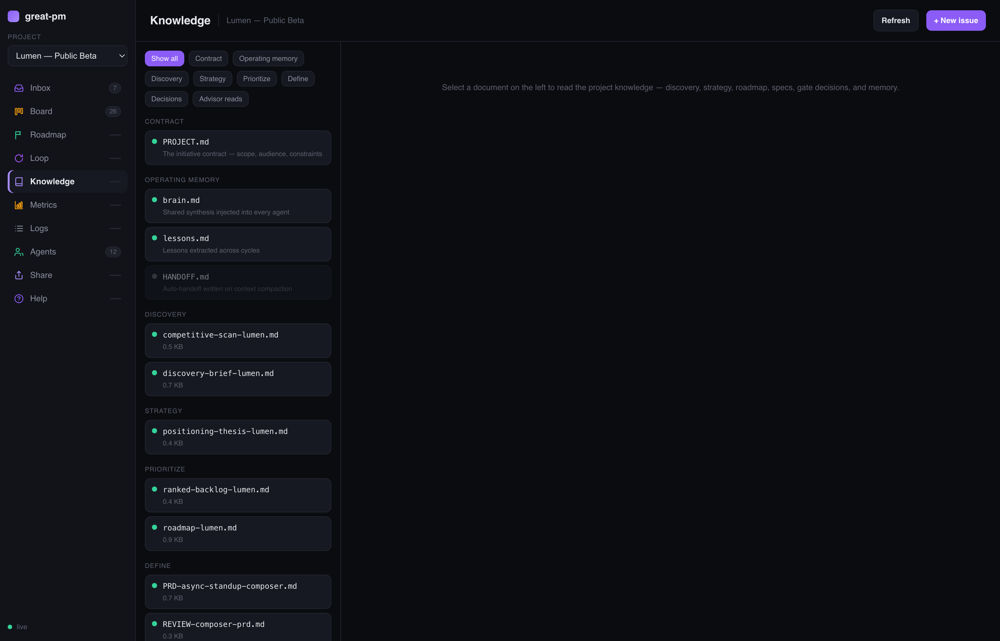
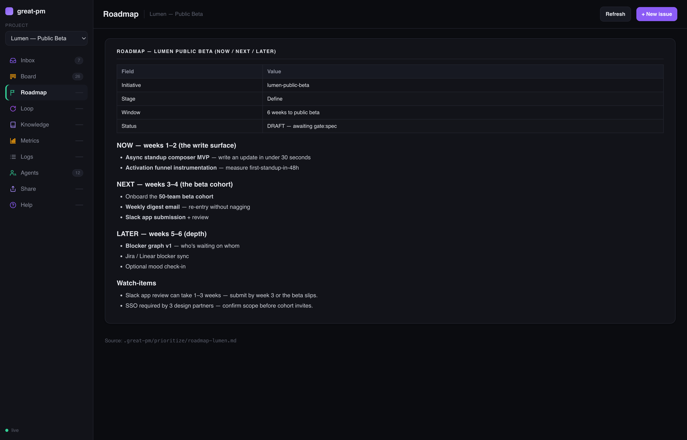
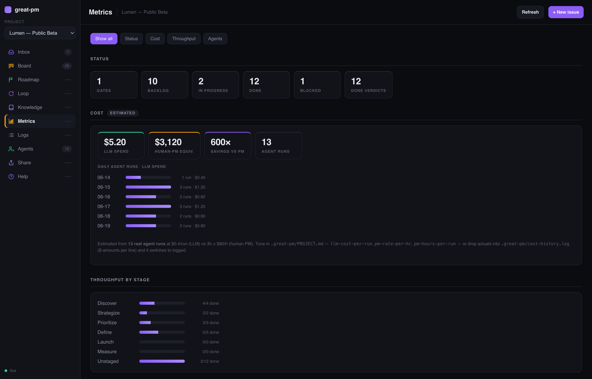
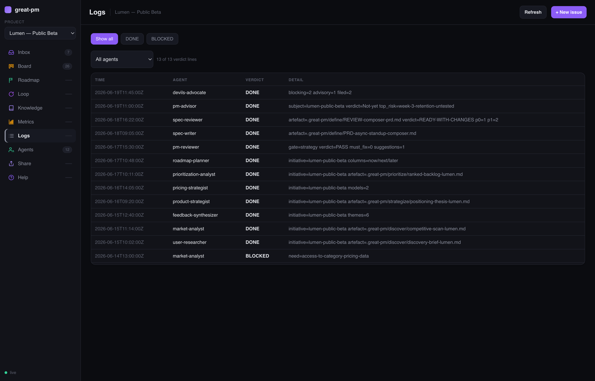
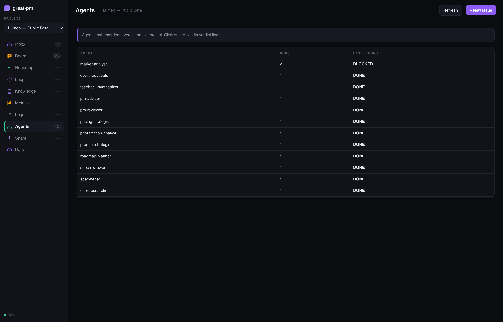
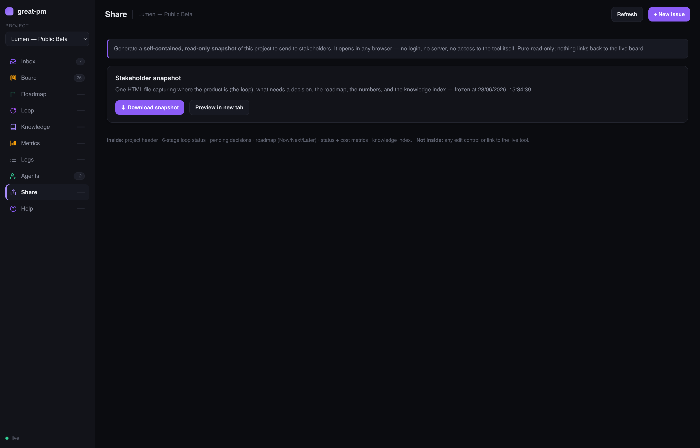
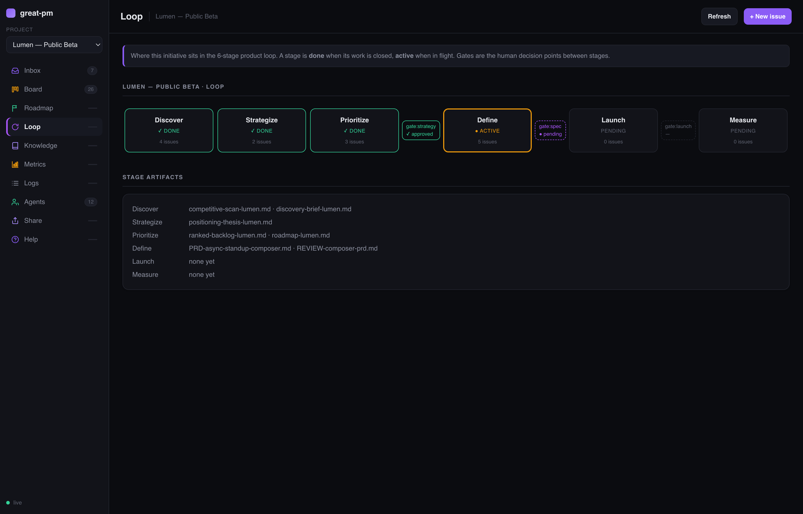
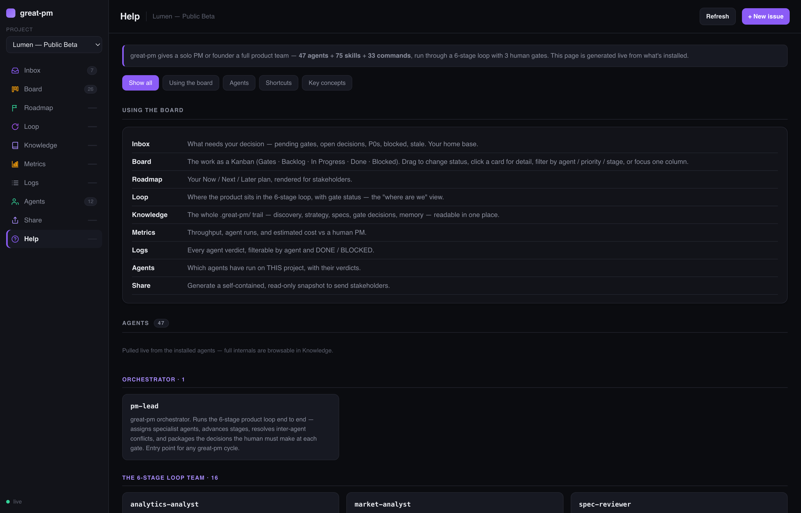

# great-pm

**Your entire product team, as software.** great-pm is a multi-agent system that
runs the full product lifecycle for a solo PM or founder — **Discover →
Strategize → Prioritize → Define → Launch → Measure** — with 48 specialist
agents, a live project board, and 3 human decision gates so you stay in control
of every call that matters. It serves both traditional PMs and AI PMs through
one tool.

It's **model-agnostic** — runs on Claude, OpenAI, Gemini, or Codex — and files
its work straight into the tools you already live in: **Notion, Slack, Linear,
Jira**, two-way, bring-your-own-token, **$0 to operate** (see
[**Connect your tools**](#connect-your-tools)).

**Status:** Claude Code v1.0.1 and Codex v1.1.3 are release
candidates pending final desktop sign-off. **48 agents · 79 skills · 34 commands/workflows** · the 6-stage loop · a native project board.
Install from this repo (see **Install** below).


<sub>The <code>/pm-board</code> board — a live knowledge layer over your product, reading straight from beads + <code>.great-pm/</code>. Shown on a sample "Lumen" initiative (demo data). Full tour in <a href="#screenshots">Screenshots</a>.</sub>

## Install in Claude Code

This repo is the Claude Code marketplace.

```
# 1. Add this repo as a plugin marketplace
/plugin marketplace add VandanaAjayDubey111/great-pm

# 2. Install the plugin
/plugin install great-pm@great-pm

# 3. Start a product initiative
/pm-start <your product or initiative>
```

On install, Claude Code auto-registers all agents (`agents/`), skills
(`skills/`, invocable as `great-pm:<skill>`), and slash commands (`commands/`),
and the lifecycle hooks (`SessionStart` context-load, `PreCompact` handoff,
`PreToolUse` safety + secret-scan) fire automatically — no manual `~/.claude`
copying.

## Install in Codex

GreatPM supports Codex desktop and Codex CLI as a native plugin with 48 agents,
79 product-management skills, and 34 workflows:

```bash
codex plugin marketplace add VandanaAjayDubey111/great-pm
codex plugin add great-pm@great-pm
```

Start a new Codex session and use `$pm-help` or `$pm-start`. Codex uses `$`
skill invocation where Claude Code uses `/` commands; the product behavior,
artefacts, specialist roles, and three human gates remain equivalent.

See [`docs/CODEX.md`](docs/CODEX.md) for desktop installation, hook trust,
first-run setup, upgrades, local testing, troubleshooting, and uninstall.

**Recommended companions** (great-pm uses them where present, degrades
gracefully where absent): [`superpowers`](https://github.com/obra/superpowers)
(brainstorming, TDD, plan-writing skills) and **beads** (`bd`) for task
tracking. These are soft recommendations, not hard install-blocking
dependencies.

## Public remote MCP

GreatPM is also live as a free, public, read-only remote MCP server:

```text
https://greatpm-mcp.vandana424-s.workers.dev/mcp
```

Add it to Codex:

```bash
codex mcp add great-pm --url https://greatpm-mcp.vandana424-s.workers.dev/mcp
```

The remote server works across compatible MCP clients and exposes curated
methods, templates, prompts, and a six-stage workflow. It does not access local
files, run the 48-agent harness, use connectors, or make writes. See the
[public MCP installation guide](docs/MCP.md) for Codex, VS Code, Claude, and
generic client setup.

Verified with Codex CLI 0.153.4 on 2026-09-20: all three tools succeeded
against the live server. See [compatibility and launch evidence](docs/MCP-READINESS.md).
The full Codex-native GreatPM plugin is packaged in `plugins/great-pm/`.
Installing the MCP gives Codex the public knowledge tools; install the native
plugin for the full product-management operating system. Both are included in
this review branch. Public repository installation requires the plugin release
to reach `main` first. See [the prepared release review](docs/release/REVIEW.md).

## What great-pm does

A product team in software:
- **grill-me** interrogates *you* — at the start and at every fuzzy decision
  after — widening the idea and surfacing the unknowns you can't see, before
  you build on them
- **user-researcher** runs JTBD and validates problems
- **feedback-synthesizer** turns the support/review/survey stream into themes
- **market-analyst** tracks competitors and sizes the opportunity
- **product-strategist** turns research into a defensible strategy
- **pricing-strategist** decides how the product makes money
- **prioritization-analyst** ranks work with 12 proven scoring methods
- **roadmap-planner** time-phases the backlog (Now / Next / Later + OKRs)
- **spec-writer** authors the PRD that hands off to engineering
- **spec-reviewer** does a lightweight mechanical PRD check
- **metrics-architect** defines success *before* the build
- **launch-manager** plans the phased rollout with rollback signals
- **gtm-strategist** writes the go-to-market plan
- **experiment-designer** designs honest A/B tests
- **analytics-analyst** reads the post-launch numbers
- **pm-reviewer** stress-tests every critical decision
- **pm-lead** orchestrates them all
- …plus a self-improvement loop (`continuous-learner` + `skill-scout`)
  and 29 additional specialist agents (AI-PM pack + archetype reviewers; 48 agents total).

## Screenshots

The board (`/pm-board`) is the **knowledge layer** over your product — 9 views, all
reading live from beads + `.great-pm/`. Shown on a sample "Lumen" initiative (demo data).

| | |
|---|---|
| **Inbox** — what needs your decision <br> | **Board** — status kanban + filters <br> |
| **Knowledge** — the whole product trail, readable <br> | **Roadmap** — Now / Next / Later <br> |
| **Metrics** — throughput + cost & savings <br> | **Logs** — every agent verdict <br> |
| **Agents** — the roster <br> | **Share** — read-only stakeholder snapshot <br> |
| **Loop** — where the product sits in the 6-stage loop <br> | **Help** — the board explains itself (live agent + command guide) <br> |

> Regenerate these anytime with `bash scripts/great-pm-shots.sh` (uses the demo project from `examples/seed-demo.sh`).

## Connect your tools

great-pm runs **on any model** and writes into **your** stack. Both work through
one portable integration layer (**the Seam**), so nothing is locked to a single
AI host.

- **Any model** — Claude Code and Codex are native plugin hosts; thin adapters
  expose the same connector layer to **OpenAI and Gemini** function calling.
- **Two-way tool connectors** — great-pm reads *and* writes **Notion**,
  **Slack**, **Linear**, **Jira**, and product analytics (**Amplitude / CSV**).
  Gate decisions, roadmaps, specs, and backlogs land in the tools your team
  already uses — not just in local files.
- **Bring your own token (BYOT)** — paste each tool's own free API token once
  into a gitignored `.great-pm/secrets.env`. **No central service, no hosted
  login, $0 to operate** — everything runs in your environment, with your keys,
  and your data never passes through us.
- **Write safety, on by default** — every external write clears a governor with
  a per-connector mode (`ask` / `gate` / `auto`, default **`ask`**), a kill
  switch, an audit log, and a *destructive-always-asks* floor.

Setup is one command per tool. Full guide — where to get each token, and the
records of each connector live-verified against its real API — is in
**[`docs/CONNECTORS.md`](docs/CONNECTORS.md)**:

```
great-pm connect setup notion --token <YOUR_TOKEN>
great-pm connect docs write --json '{"title":"Q3 Roadmap","body":"# Now\n- ship it"}'
```

## The loop

The 6-stage product loop is the lifecycle of one initiative:

```
1. DISCOVER    →  user research, feedback, market intel
2. STRATEGIZE  →  vision, differentiation, pricing
3. PRIORITIZE  →  scoring, roadmap, OKRs        →→ gate:strategy 🟡
4. DEFINE      →  PRD, success metrics          →→ gate:spec 🔵
   ↓ [handoff: PRD → engineering builds it]
5. LAUNCH      →  rollout, GTM                  →→ gate:launch 🟢
6. MEASURE     →  analytics, experiments  ──┐
                                            └→ feeds the next DISCOVER
```

**great-pm runs MANY initiatives in parallel** — each at its own stage. Unrelated
work never blocks unrelated work. Always-on agents (feedback-synthesizer,
market-analyst, skill-scout, stakeholder-comms) never stop and are never
blocked.

## The 3 gates — your decision points

- **gate:strategy** — problem validated, earns a roadmap slot
- **gate:spec** — PRD is clear and build-ready (lightweight review)
- **gate:launch** — built and launch-ready

Every gate package passes through `pm-reviewer` **before** the human sees it —
mandatory; the verdict travels unedited.

## Governance — the one rule

Agents **DRAFT** and **PROPOSE**. They never ship, build, commit, or finalize
on their own. Every critical/final/production decision routes through the
human. The 3 gates are the formal approval checkpoints.

One narrow exception: `skill-scout` may swap a skill autonomously *only* when
the change is isolated to one agent, non-critical, and touches nothing else —
otherwise it proposes. Every autonomous swap is logged and reversible.

## Getting started

1. Install the plugin for your host (see the install sections above) — agents,
   skills, commands, and hooks register automatically.
2. Copy `templates/PROJECT.md.template` to your project's `.great-pm/PROJECT.md`
   and customize.
3. Run `/pm-start "<problem or opportunity>"` in Claude Code or
   `$pm-start "<problem or opportunity>"` in Codex. Then use the corresponding
   host syntax for `pm-inbox`, `pm-board`, `pm-help`, and `pm-save`.

## Architecture

- **agents/** — 48 agent definitions: the 6-stage loop team, the critical quartet
  (grill-me / pm-reviewer / pm-advisor / devils-advocate), the AI-PM pack, and
  archetype + domain reviewers.
- **skills/** — 79 skills (foundational + agent-specific + the vendored MIT PM
  library; provenance in each `SKILL.md`).
- **commands/** — 34 slash commands.
- **board/** — the native zero-dependency project board (`/pm-board`): a Node-stdlib
  server + vanilla UI serving a hybrid stage×status Kanban, artifact panels, and
  verdict metrics on `localhost:3142`.
- **scripts/** — the SessionStart context/loop hook + the skill-doctor health check.
- **templates/** — PROJECT.md and deliverable templates.
- **.claude-plugin/** — `plugin.json` (manifest + hooks) and `marketplace.json`.
- **plugins/great-pm/** — generated, installable Codex package.
- **.agents/plugins/marketplace.json** — repository marketplace for Codex.
- **codex/** — deterministic packager, native host bindings, and parity tests.
- **docs/HARNESS-LOOPS.md** — the feedback loops + Open-Decision Register design.

## Status

**Claude Code v1.0.1 and Codex v1.1.3 are release candidates pending final
desktop sign-off.** The package contains 48 agents (6-stage loop +
critical quartet + AI-PM pack + archetype/domain reviewers), 79 skills, the
6-stage loop with 3 human gates, the self-correcting loops (learning · feedback
· brain-freshness), and the Open-Decision Register that stops questions from
getting lost. Installable as a native plugin from this repo.

## License

MIT — see [`LICENSE`](LICENSE) and [`NOTICE.md`](NOTICE.md) for the full
derivation chain (great-pm is derived from `ajayd942/great_cto`, which is a
fork of `avelikiy/great_cto`).

## Credits

- **avelikiy** for the original `great_cto` — the plugin architecture, the
  agent format, the memory layers, the gate mechanism. great-pm is built on
  these foundations.
- **Ajay Dubey (ajayd942)** for the fork that added the `code-reviewer`
  agent, `performance-engineer` activation, memory fixes, and hook
  improvements that great-pm seeded from.
- **Vandana Dubey** — great-pm.
